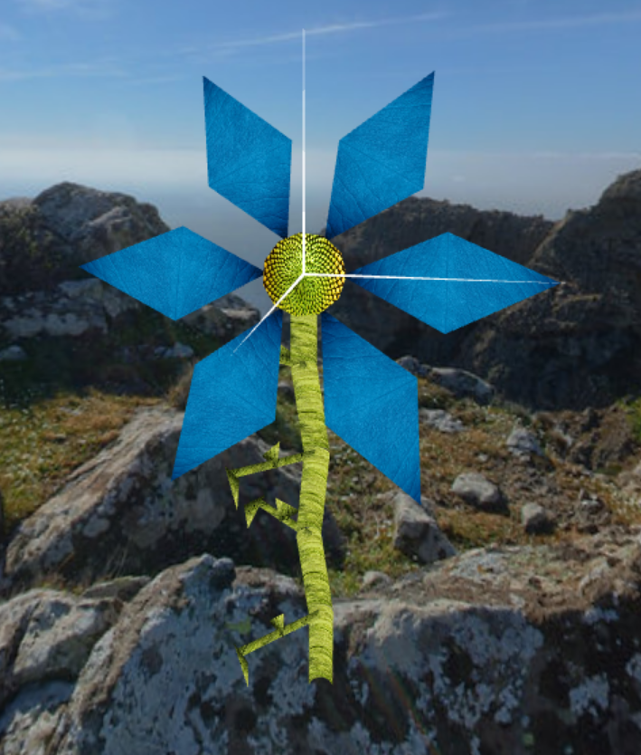

# CG 2023/2024

## Group T04G02

- Francisca Guimarães | up202004229
- Inês Oliveira | up202103343

## PROJ Notes

### 1. Sky-Sphere

### 2. Flower

To create the flower we use several simple polygons, such as triangles (for the petals and the leaves of the stem), a cylinder (for the stem) and a circle (for the heart of the flower).

The flower is created using various parameters, such as the outer radius of the flower, the number of petals, the color of the petals, the radius of the circle of the heart of the flower, the color of the circle of the heart of the flower, the radius of the cylinder of the stem, the size of the stem, the color of the stem and the color of the leaves. These parameters are chosen at random.

After creating the flower, we create a MyGarden class that generates several flowers, depending on the value of rows and columns chosen by the user in the program interface. 

### 3. Rocks

### 4. Bee
#### 4.1. Modeling

#### 4.3 Movement 

### 5. Pollen and Hive 

#### Objects

We've created the pollen, with the visual appearance of an egg and an orange texture, which is positioned in the center of each flower. 

We've also created a beehive where the bee leaves the pollen. The base is made up of 5 rectangles so that it looks like a parallelepiped without the top and a lid with 5 phases. Inside the hive are some pollens.

#### Picking and Dropping functionality

### 6. Bee

#### Shaders and animation

