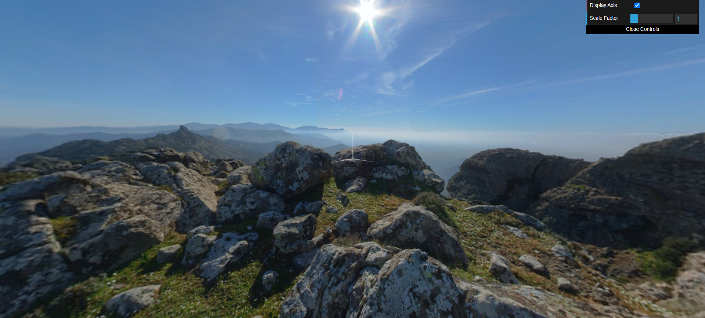
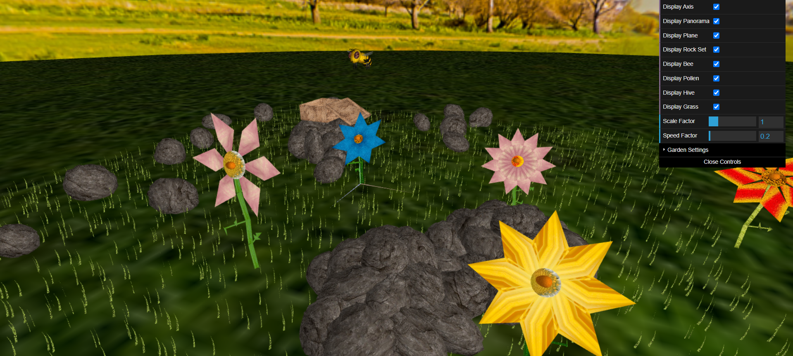

# CG 2023/2024

## Group T04G02

- Francisca Guimarães | up202004229
- Inês Oliveira | up202103343

## PROJ Notes

### 1. Sky-Sphere

#### 1.1 Creation of the Sphere

We introduced the MySphere class to generate a sphere centered at the origin with a unit radius and variable slices and stacks for smooth curvature. The class efficiently handles texture mappings, optimizing the sphere for both appearance and performance.

#### 1.2 Addition of Panoramas

The MyPanorama class extends the functionality by applying a 360º equirectangular texture to an inverted MySphere, making it visible only from the inside. This creates a convincing environment that envelops the user, with a radius set to 200 units to encompass the viewing area fully.

### 2. Flower

To create the flower we use several simple polygons, such as triangles (for the petals and the leaves of the stem), a cylinder (for the stem) and a circle (for the heart of the flower).

The flower is created using various parameters, such as the outer radius of the flower, the number of petals, the color of the petals, the radius of the circle of the heart of the flower, the color of the circle of the heart of the flower, the radius of the cylinder of the stem, the size of the stem, the color of the stem and the color of the leaves. These parameters are chosen at random.

After creating the flower, we create a MyGarden class that generates several flowers, depending on the value of rows and columns chosen by the user in the program interface. 

### 3. Rocks

The MyRock class is developed to simulate realistic rocks by slightly modifying the vertices of a basic sphere shape. This adjustment involves moving the vertices slightly inward or outward along their normals, creating natural-looking protrusions and indentations on the rock surface, akin to those seen on real-life pebbles. 

To create a natural and visually appealing pile of rocks, we introduced the MyRockSet class. This class manages a collection of rocks, each with random orientations and sizes achieved through non-uniform scaling. The rocks are arranged in a manner reminiscent of a rock pyramid or a casually piled heap.

### 4. Bee

#### 4.1. Modeling

The MyBee class was developed to model the bee. It incorporates:
- head with eyes, a thorax and adbomen.
- A pair of semi-transparent wings, a pair of antennae and three pairs of legs.

Each component is textured and colored to represent different parts of the bee’s body effectively, with transparency implemented in the wings to mimic their delicate nature. This transparency is managed through WebGL’s alpha blending functionalities to ensure that the wings are rendered correctly in the scene.

#### 4.3 Movement 

Enhancements were made to the MyInterface class to handle multiple key inputs simultaneously, allowing for nuanced control over the bee’s movement through the scene. This includes:

- Movement controls with "W" and "S" keys for acceleration and deceleration, respectively.
- Directional controls with "A" and "D" for turning left and right.
- Reset functionality with "R" to return the bee to its initial position and speed.

Additionally, sliders were added to the interface to adjust the speed factor and scale factor of the bee, allowing users to customize the sensitivity of the bee’s movements and its size in the scene.

### 5. Pollen and Hive 

#### Objects

We've created the pollen, with the visual appearance of an egg and an orange texture, which is positioned in the center of each flower. 

We've also created a beehive where the bee leaves the pollen. The base is made up of 5 rectangles so that it looks like a box without the top and a lid with 5 phases. 

#### Picking and Dropping functionality

We've implemented an interactive feature that allows the bee to pick up and drop pollen grains. This functionality is controlled through keyboard inputs, simulating the bee's natural behavior of pollen collection and deposition at the hive.

We implemented two modes for this movement. The normal mode and the enhanced mode.

(F key) For the normal mode:

- To enable the bee to collect pollen, users press the "F" key. Upon activation, the bee descends while maintaining its horizontal (XZ) velocity until it makes contact with a flower or the floor, if the latter it will bounce back to its original position. At this point, if a flower is found, the bee halts its descent and stays at the flower.

(F key) For the enhanced mode:

- When users press the "F" key the bee moves to the nearest flower, stopping its velocity and positioning itself right above the flower. 

(P key) For both modes:

- When users press P key the pollen is collected, this is achieved by attaching a reference of the pollen grain to the MyBee class, which then becomes responsible for rendering the pollen on the bee's display. Concurrently, the pollen reference is removed from the flower in the scene, ceasing its rendering at the original location. The bee then resumes its prior movement pattern, now carrying the pollen grain. 

(O key) For both modes: 

- If the bee is already in flight with a pollen grain and the "O" key is pressed, it navigates towards the beehive's entrance. Upon arrival, the pollen grain is transferred from the bee to the hive. This involves adding the pollen reference to the hive, which then takes over its rendering. Simultaneously, the reference is removed from the MyBee class, which stops displaying the pollen grain. 

### 6. Shaders and animation

In our grass implementation, we utilize shaders to dynamically simulate the movement and lighting of grass as it sways in response to wind. The vertex shader, central to this effect, adjusts each blade of grass based on time, wind intensity, and frequency. Using attributes such as aVertexPosition, aVertexNormal, and aTextureCoord, each vertex's position is calculated to reflect its dynamic displacement.
This snippet calculates the vertex offset by applying a sine wave function, scaled by the grass blade's height and modulated by waveIntensity and waveFrequency, creating a more natural curve movement.

### 7. Additional developments

Of the two alternatives given, we chose to implement a parabola-shaped trajectory for the bee when it descends or ascends from a flower, as well as when it heads towards the hive.

To integrate the parabolic trajectory, we calculated the start, peak, and end points of the path based on the target position and height offset, ensuring a smooth, realistic arc. The bee's position is dynamically updated along this path, combining both vertical and horizontal movement to follow the parabola accurately. This coordination results in the bee descending to flowers, ascending with pollen, and heading towards the hive, enhancing the overall realism of its movement. 

The screenshot below is of the final scene look

