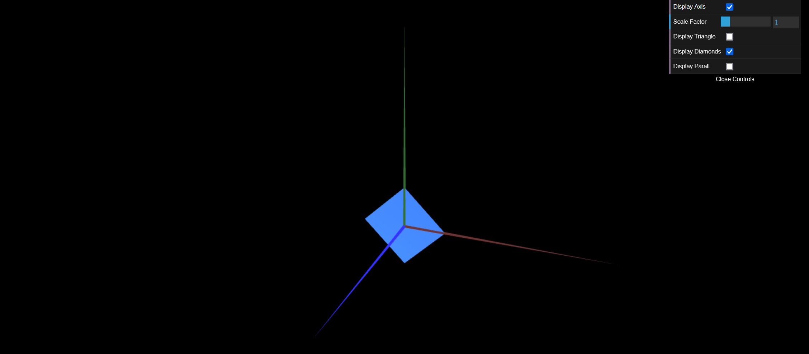
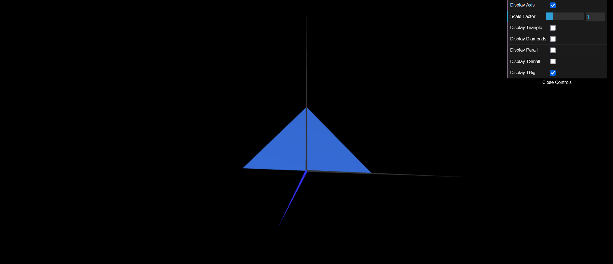

# CG 2023/2024

## Group T04G02

## TP 1 Notes

- In exercise 1, we created a triangle and a parallelogram (made up of two triangles), using the code provided in MyDiamond.js. We added checkboxes for all the figures. We had trouble figuring out how to mirror the image, so you can see it from both sides.

- In exercise 2 we created a small triangle and a big triangle, also with the checkboxes.

