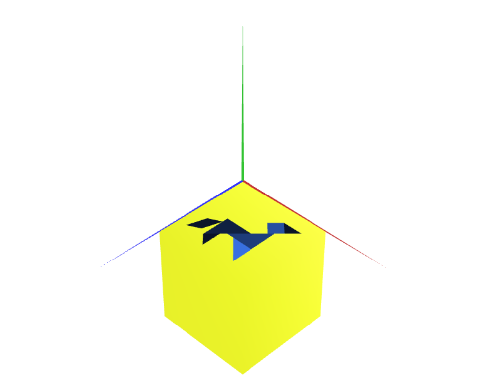

# CG 2023/2024

## Group T04G02

## TP 2 Notes

- We completed all tasks successfully. We took a bit of time to understand how rotation works in Exercise 1, but eventually, we understood it.

- In exercise, although we weren't sure where to place the unit cube at first, we think we got it right in the end. To make things clearer, we colored the cube differently from the tangram.

- In exercise 3, the problem was more or less the same as the previous one, just slighty different way of approaching it. We found no difficulties and decided to change the color of the cube for a better differenciation from the tangram and exercise 2.

