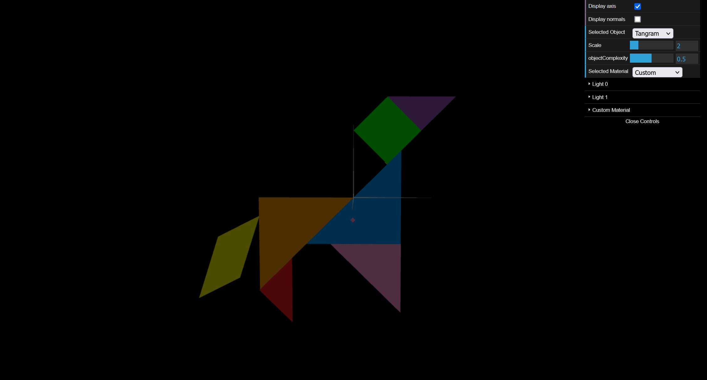
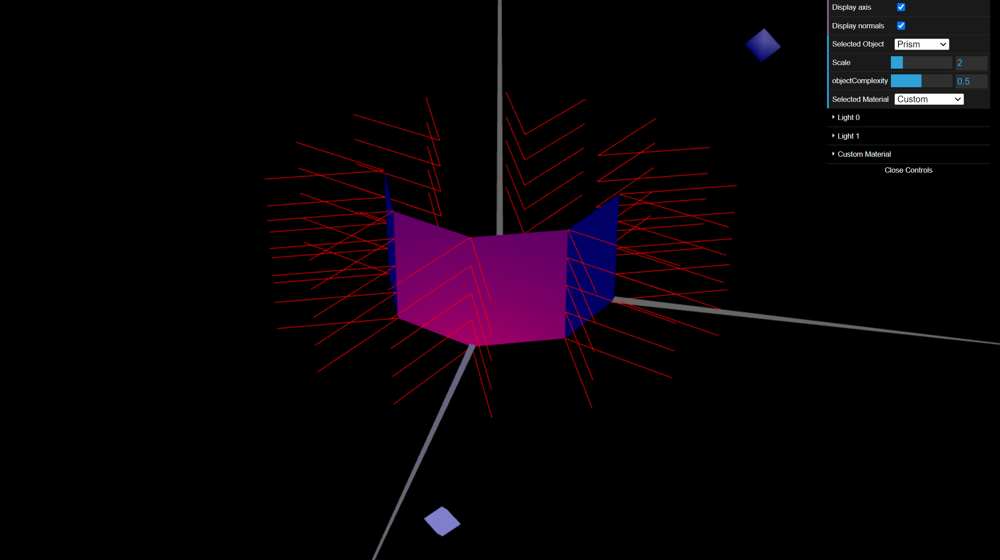
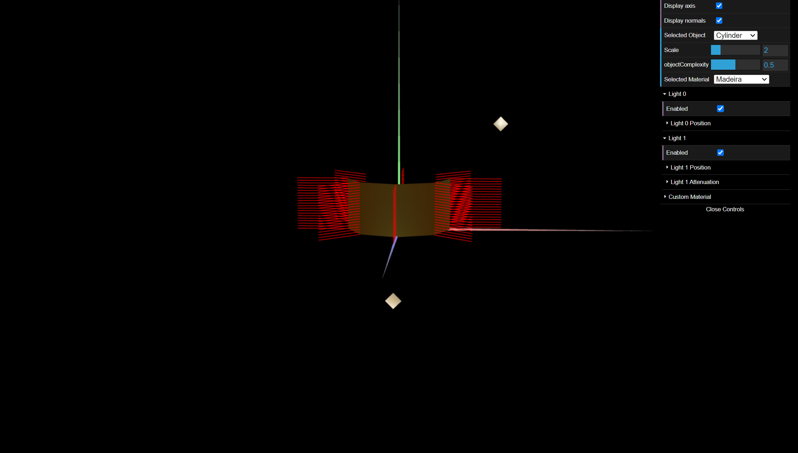

# CG 2023/2024

## Group T04G02

## TP 3 Notes

In exercise 1, we learned how to create normals on different geometric figures. We also learned how to apply textures to the elements and how to apply lights from different angles.

To solve exercise 2 we found it difficult to understand the logic of the prism-building algorithm, with the various stacks. The estimated illumination was comparable to that obtained using Constant Shading, since the normals of the same face remain constant.

Unlike the exercise 2, the normals have now been applied to the perpendiculars of each edge. As you'd expect, the edges have been smoothed out, giving them a more curved and therefore cylinder-like appearance.

