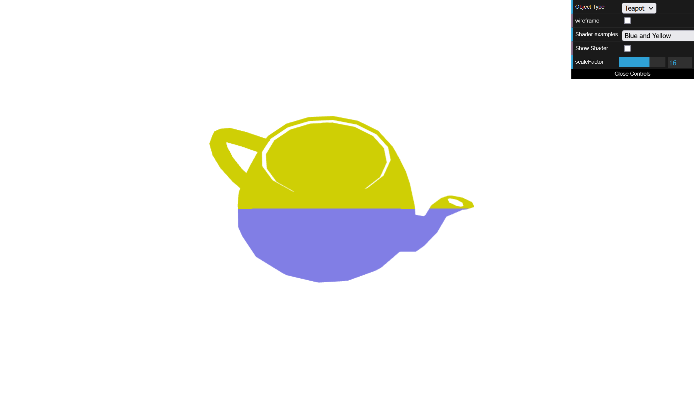
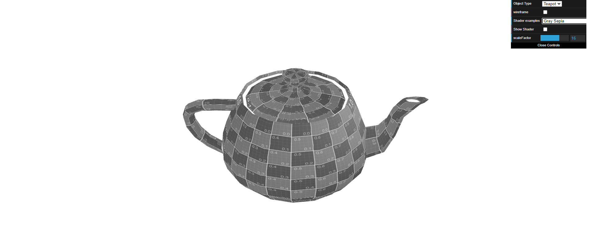
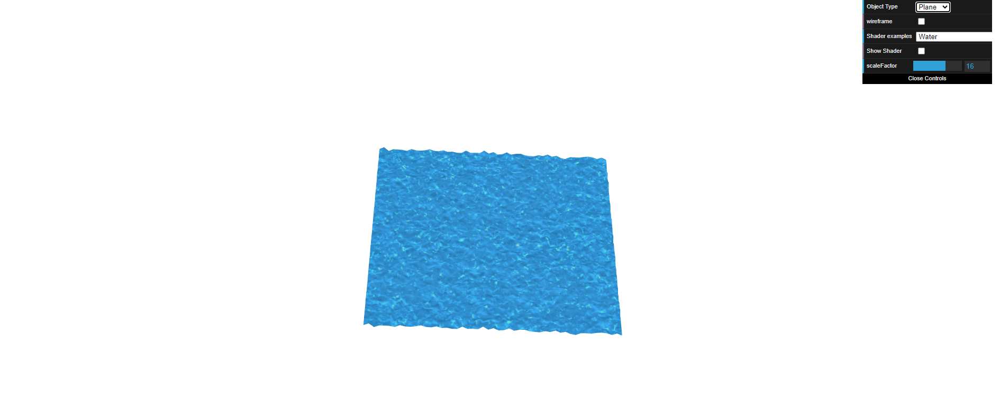

# CG 2023/2024

## Group T04G02

## TP 5 Notes

In exercise 1, we learned how to create vertex and fragment shaders. At first, we had some difficulties changing the animation shader to create a translation effect.

In exercise 2, we accomplished all tasks without any difficulties.

